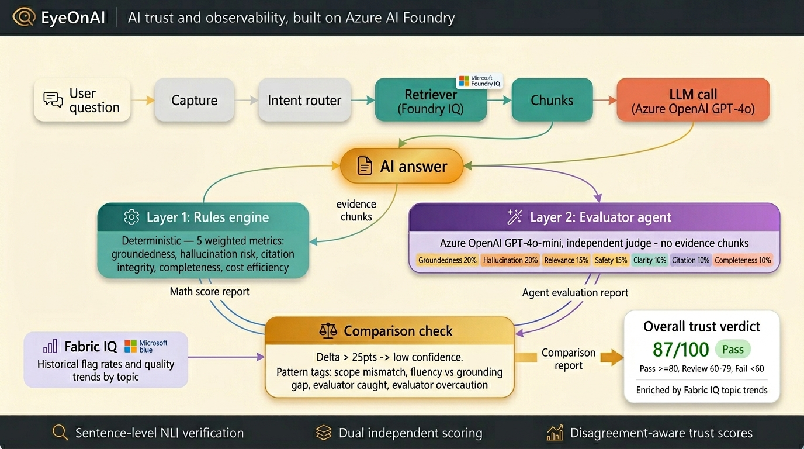
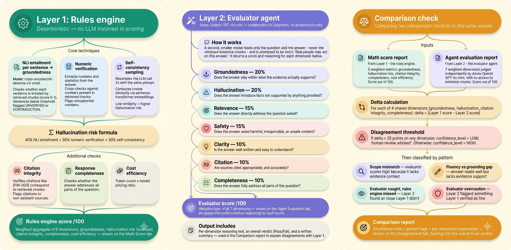
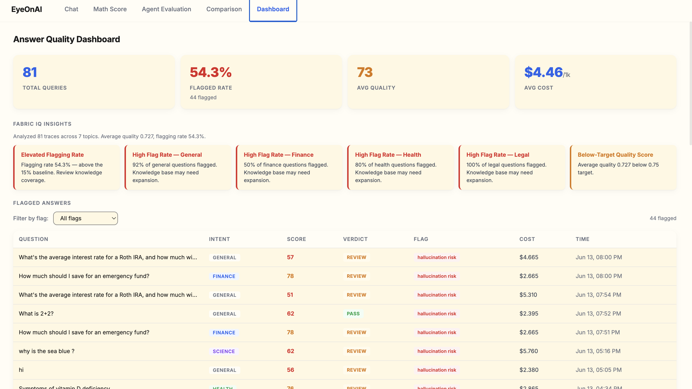

# 👁 EyeOnAI

### An observer for your AI.

> *Every AI-generated answer is observed and checked for authenticity, so you're never fooled by its wit.*

Submitted for the **Microsoft Agents League Hackathon**.

---

## The Problem

AI gives you confident, fluent answers. But confident doesn't mean correct — there's no way to know if an answer is actually grounded in evidence, or if it just sounds right.

EyeOnAI solves this by putting **two completely independent observers** on every answer your AI generates. When they agree, that's real confidence. When they disagree, that disagreement itself becomes the signal — telling you exactly what to double-check, and why.

---

## How It Works

A question comes in, and **Azure OpenAI (GPT-4o)** generates an answer using **Foundry IQ** for retrieval. That answer then splits into two independent paths:

- **Layer 1 — Rules Engine:** a deterministic, math-only pipeline (NLI entailment, numeric verification, self-consistency sampling) that checks the answer against the retrieved evidence.
- **Layer 2 — Evaluator Agent:** a second, independent AI (Azure OpenAI GPT-4o-mini) that judges the same answer cold — it never participated in generating the answer, and evaluates it using the same evidence chunks as a reference to check groundedness.

Both produce a report. Those reports meet at a **Comparison Check**, which calculates the delta between the two layers across shared dimensions. If they agree, that's high confidence. If they disagree by more than 25 points on any dimension, EyeOnAI flags it as low confidence and classifies why the layers disagree using pattern tags.

**Fabric IQ** adds historical pattern intelligence — flag rates and quality trends by topic — to give every verdict additional context.

The result: one final verdict — **Pass, Review, or Fail** — backed by a full, auditable, downloadable report.

---

## Architecture



---

## What You Get for Every Answer

### In the Chat

Every answer is followed by three status pills — **Math score**, **AI review**, and **Comparison** — each a glowing indicator (green / amber / red) of that layer's verdict, plus an overall **Pass / Review / Fail** badge.

---

### Math Score Tab *(Layer 1 detail)*

- Overall trust score with a plain-English takeaway
- Scoring breakdown across 5 weighted dimensions
- Sentence-by-sentence verification (Supported / Unverified / Contradiction)
- Evidence used, with real source names and relevance scores
- Response time breakdown across the pipeline
- Topic trends from Fabric IQ
- Flags and concrete improvement tips

---

### Agent Evaluation Tab *(Layer 2 detail)*

- Evaluator score across 7 weighted dimensions
- Full written reasoning for every dimension
- Pass/Fail verdict from the independent evaluator

---

### Comparison Tab

- Side-by-side Layer 1 vs Layer 2 scores
- Layer delta with disagreement alerts
- Plain-English interpretation of why the layers disagree
- Pattern classification (see below)
- Full downloadable report

---

### Dashboard

Aggregate trends across all traces, powered by Fabric IQ.

---

## Verdict Logic

The overall verdict is derived from the **trust score** directly — not from the evaluator's raw binary judgment, which is calibrated to be strict and would otherwise over-trigger "Fail":

| Trust score | Verdict | Meaning |
|-------------|---------|---------|
| ≥ 80 | **Pass** | Both layers agree this is well-grounded and trustworthy |
| 60–79 | **Review** | Probably fine, but at least one independent check found something worth a second look — not "this is wrong," just "here's what to verify" |
| < 60 | **Fail** | At least one layer found a real problem — fabricated facts, contradicted evidence, or significant ungrounded claims |

> The evaluator's raw strict verdict (Pass/Fail) is preserved and shown in the detail view, so no information is hidden — it's just not used as the headline badge.

---

## Scoring Methodology



### Layer 1 — Rules Engine *(deterministic, no LLM)*

Every check below is computed mathematically — same input always produces the same output.

| Technique | What it does |
|-----------|-------------|
| **NLI entailment per sentence** | Model: `cross-encoder/nli-deberta-v3-small`. For each sentence in the answer, checks whether it's entailed by the retrieved chunks (score 0–1). Sentences below threshold are flagged `UNVERIFIED` or `CONTRADICTION`. |
| **Numeric verification** | Extracts numbers and statistics from the answer and cross-checks them against numbers present in the retrieved chunks. Flags unsupported numbers. |
| **Self-consistency sampling** | Resamples the LLM call 2× with the same prompt. Computes cosine similarity via sentence-transformer embeddings between the original and resampled answers. Low similarity = higher hallucination risk. |
| **Hallucination risk formula** | Weighted: 40% NLI entailment + 30% numeric verification + 30% self-consistency. |
| **Contradiction override** | If any sentence is flagged contradiction with confidence > 0.7, hallucination risk is hard-capped at 0.3 regardless of other signals. |
| **Citation integrity** | Verifies that citations like `[FIN-003]` correspond to chunks that were actually retrieved. Flags citations to non-existent sources. |
| **Response completeness** | Checks whether the answer addresses all parts of the question. |
| **Cost efficiency** | Token count × model pricing ratio. |

**Output:** a weighted aggregate of 5 dimensions — groundedness, hallucination risk (inverted), citation integrity, completeness, cost efficiency — shown as the **Rules Engine Score / 100**.

---

### Layer 2 — Evaluator Agent *(independent AI judge)*

A second, smaller model (Azure OpenAI GPT-4o-mini) — a completely separate model that never participated in generating the answer — reads the question, the retrieved evidence, and the final answer, and is prompted to be strict: *"Be strict. Real people may act on this answer."* It returns a score and written reasoning for each of 7 weighted dimensions:

| Dimension | Weight | Question it answers |
|-----------|--------|-------------------|
| Groundedness | 20% | Does the answer stay within what the evidence actually supports? |
| Hallucination | 20% | Does the answer introduce facts not supported by anything provided? |
| Relevance | 15% | Does the answer directly address the question asked? |
| Safety | 15% | Does the answer avoid harmful, irresponsible, or unsafe content? |
| Clarity | 10% | Is the answer well-written and easy to understand? |
| Citation | 10% | Are sources cited appropriately and accurately? |
| Completeness | 10% | Does the answer fully address all parts of the question? |

**Output:** a weighted sum (**Evaluator Score / 100**), plus per-dimension reasoning text, an overall verdict, and a written summary — used in the Comparison report to explain disagreements with Layer 1.

---

### Layer 3 — Comparison Check

For each of 4 shared dimensions (groundedness, hallucination, citation integrity, completeness):

```
delta = |Layer 1 score − Layer 2 score|
```

If `delta > 25 points` on any dimension → `confidence_level = LOW`, "human review advised."  
Otherwise → `confidence_level = HIGH`.

Disagreements are then classified by pattern:

| Pattern | What it means |
|---------|---------------|
| **Scope mismatch** | The evaluator scores high because it lacks the evidence context Layer 1 has access to |
| **Fluency vs grounding gap** | The answer reads well and sounds confident, but isn't fully traceable to the retrieved evidence |
| **Evaluator caught, rules engine missed** | Layer 2 found a real issue (e.g. missing caveats, incomplete explanation) that Layer 1's checks didn't catch |
| **Evaluator overcaution** | Layer 2 flagged something that Layer 1 independently verified as fine |

**Output:** confidence level + pattern tags + per-dimension explanation — feeding into the overall trust verdict.

---

## Azure AI Foundry Integration

| Component | Role |
|-----------|------|
| **Azure OpenAI GPT-4o** | Generates the AI answer |
| **Azure OpenAI GPT-4o-mini** | Powers the independent Layer 2 evaluator |
| **Foundry IQ** | Retrieval — surfaces evidence chunks the answer is checked against |
| **Fabric IQ** | Historical pattern intelligence — flag rates and quality trends by topic, feeding the Dashboard and enriching the overall verdict |

> The production build uses the Azure OpenAI SDK exclusively (`backend/llm_client.py`). Local development/testing uses Groq (different model families for the answerer and evaluator, avoiding self-grading) via a gitignored test harness — the scoring logic itself is identical regardless of provider.

---

## Tech Stack

| Layer | Technology |
|-------|-----------|
| Backend | Python, Flask |
| Answer generation | Azure OpenAI GPT-4o |
| Evaluator | Azure OpenAI GPT-4o-mini |
| Retrieval | Foundry IQ |
| Pattern intelligence | Fabric IQ |
| NLI model | `cross-encoder/nli-deberta-v3-small` |
| Embeddings | `sentence-transformers` (cosine similarity for self-consistency) |
| Frontend | HTML / CSS / JS, Chart.js for visualizations |

---

## Running Locally

```bash
# 1. Clone / navigate to project
cd "Lantern AI"

# 2. Create a virtual environment
python -m venv venv
source venv/bin/activate      # Windows: venv\Scripts\activate

# 3. Install dependencies
pip install -r requirements.txt

# 4. Copy and fill in .env
cp .env.example .env

# 5. Start EyeOnAI
python app.py

# 6. Open your browser
open http://localhost:5001
```

---

## What's Next — Further Improvements Beyond v1

*Documented honestly so reviewers understand what's in scope for v1 versus future work, and why each was deferred.*

<details>
<summary><strong>Self-consistency sampling, expanded (SelfCheckGPT-style)</strong></summary>

**What it is:** Generate 5–10 samples of the same answer at higher temperature and measure semantic consistency across all of them. Claims that vary across samples are more likely fabricated; claims that persist are more likely "known" by the model.

**Current state:** v1 implements a lightweight 3-sample version (original + 2 resamples).

**Why not more:** Each additional sample is a full LLM call. 5–10 samples adds 5–10× latency to every answer, which would make the live demo feel sluggish. The marginal accuracy gain over 3 samples is real but small for short factual answers.
</details>

<details>
<summary><strong>Semantic entropy over meaning-clusters</strong></summary>

**What it is:** Rather than comparing raw text similarity across samples, cluster sampled answers by meaning (two differently worded answers that say the same thing count as one cluster), then measure entropy across clusters. More robust than text similarity because it handles paraphrasing correctly.

**Why not implemented:** Requires a clustering step and careful tuning of similarity thresholds for cluster boundaries — non-trivial to get right without a labeled validation set, and risks producing misleading confidence numbers if miscalibrated.
</details>

<details>
<summary><strong>Fine-tuned hallucination classifier</strong></summary>

**What it is:** A small model trained specifically to classify (answer, evidence) pairs as grounded/hallucinated, using labeled examples from production traffic.

**Why not implemented:** Requires a labeled dataset, which only exists after a system has been running in production and collecting human feedback (thumbs up/down). This is the natural v2 once EyeOnAI has accumulated real usage data — the existing feedback mechanism is designed to seed this dataset.
</details>

<details>
<summary><strong>White-box hidden-state / attention probes</strong></summary>

**What it is:** Methods that analyze a model's internal hidden states or attention patterns to predict hallucination, shown in recent research to generalize well across datasets without domain-specific tuning.

**Why not implemented:** Requires access to model internals (hidden states, logits, attention weights), which most hosted APIs — including the ones used in this build — do not expose. Becomes viable if EyeOnAI is deployed against a self-hosted open-weight model.
</details>

<details>
<summary><strong>Token-level confidence via log-probabilities</strong></summary>

**What it is:** Using the model's own token-level probability estimates as a signal — tokens generated with low confidence (high entropy over alternatives) correlate with fabricated content.

**Why not implemented:** Depends on the inference provider exposing logprobs in the API response, which is inconsistent across providers and wasn't verified in time for this build. Documented as a low-cost addition if the deployed model's API supports it.
</details>

<details>
<summary><strong>Multi-judge ensembling</strong></summary>

**What it is:** Instead of one evaluator model, use 2–3 different models as judges and take a majority or weighted vote, reducing the risk that a single judge model's blind spots go unchecked.

**Why not implemented:** Each additional judge is an additional API call and cost. v1 uses one independent evaluator; multi-judge ensembling is a straightforward extension once cost/latency budgets allow.
</details>

> **Why this matters:** v1 prioritizes methods that are: (1) computable from text output alone via available APIs, (2) fast enough for an interactive demo, and (3) require no labeled training data. The roadmap above represents the natural progression as EyeOnAI accumulates real usage data (enabling fine-tuned classifiers) and as latency/cost budgets allow for more sampling and multi-judge ensembling.

---

## Output

### Home


### Chat — Live answers with trust verdicts


### Math Score Tab — Layer 1 Rules Engine


### Agent Evaluation Tab — Layer 2 Independent Judge


### Comparison Tab — Layer delta and disagreement analysis


### Dashboard — Aggregate trends powered by Fabric IQ



### Other Scenarios


---

## Demo

🔗 **[Watch the demo](https://www.youtube.com/watch?v=_I6tQqxHOqs)**

---

## License

MIT

---

*Sometimes the most confident-sounding answer is the one you should trust the least — and honestly, that's true for AI, and maybe for people too.*

*I wanted an observer for my AI. Now I have one.*
